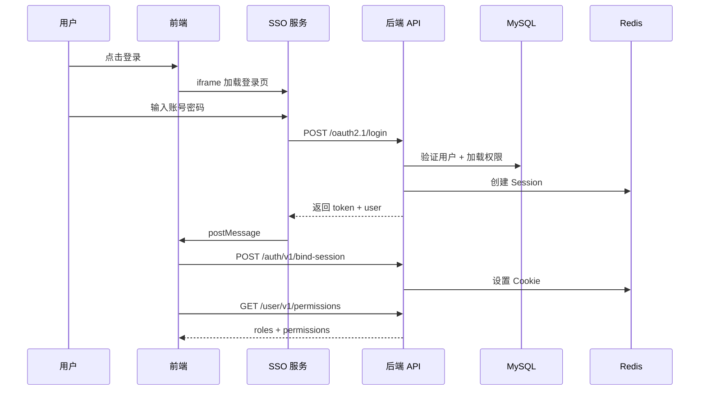

# CoreFlow — 企业级全栈安全平台

<p align="center">
  <strong>基于 Node.js 的 OAuth 2.1 授权中心 + Web 应用防火墙 + PBAC 权限系统</strong>
</p>

<p align="center">
  
  
  
  
  
  
</p>

---

## 核心特性

- **OAuth 2.1 授权中心** — 完整实现授权码+PKCE、客户端凭证、设备码、OIDC 发现
- **Web 应用防火墙** — 五层拦截管道：连接追踪→封禁→挑战→Bot检测→地理围栏
- **PBAC 权限系统** — 策略级访问控制，三级守卫（System→Group→API），通配符匹配
- **双模式认证** — Session Cookie（默认）和 JWT Bearer 灵活切换
- **多应用支持** — 一个后端服务多个前端应用，按应用隔离权限和会话
- **优雅降级** — Redis 不可用时自动降级到内存模式

---

## 快速开始

```bash
# 克隆项目
git clone https://github.com/your-username/nodeservers.git
cd nodeservers

# 安装依赖
npm install

# 配置环境变量
cp .env.example .env
# 编辑 .env 填入数据库、Redis 等配置

# 执行数据库迁移
npm run migrate

# 初始化超级管理员
npm run setup:admin -- --email admin@example.com

# 启动服务
npm run dev
```

---

## 项目结构

```
nodeservers/
├── src/                        # 后端源码
│   ├── api/                    # API 路由层
│   │   ├── oauth21/v1/         # OAuth 2.1 授权端点
│   │   ├── user/v1/            # 用户中心 API
│   │   ├── admin/v1/           # 管理后台 API
│   │   ├── auth/v1/            # 认证服务 API
│   │   ├── notice/v1/          # 通知中心 API
│   │   ├── verify/v1/          # 验证服务 API
│   │   └── firewall/v1/        # 防火墙 API
│   ├── app/                    # 业务逻辑层
│   │   ├── oauth21/            # OAuth 2.1 核心（JWT、PKCE、加密）
│   │   ├── user/               # 用户业务（注册、OSS 上传）
│   │   ├── admin/              # IAM 管理
│   │   ├── notice/             # 通知服务
│   │   └── firewall/           # 防火墙引擎（检测器、管道）
│   ├── auth/                   # 认证框架（Session、Cookie、权限加载）
│   ├── models/                 # Sequelize 数据模型
│   ├── db/                     # 数据库连接与迁移
│   ├── redis/                  # Redis 模块（Session、限流、Nonce）
│   ├── loader/                 # 模块自动加载引擎
│   └── verify/                 # 验证码服务（图形/滑块/邮件/短信）
├── firewall/                   # 防火墙前端 (Vue 3)
├── oauth21/                    # SSO 登录前端 (Vue 3)
├── admin/                      # 管理后台前端 (Vue 3)
├── migrations/                 # 数据库迁移文件
├── public/                     # 静态资源
└── scripts/                    # 工具脚本
```

---

## 认证架构



---

## 权限系统 (PBAC)

### 三级守卫

| 级别 | 来源 | 配置项 |
|------|------|--------|
| System | `system.json` | enabled, allowIps, requireLogin |
| Group | `registerGroupMetadata()` | enabled, allowIps, allowRoles |
| API | `registerSecureRoute()` | permission, requireLogin |

### 权限匹配

```javascript
// 单个权限
registerSecureRoute(fastify, {
  permission: 'fw:config:read',
  handler: async (req, reply) => { ... }
})

// 任一满足（OR）
registerSecureRoute(fastify, {
  permission: { any: ['fw:block:write', 'fw:admin:*'] },
  handler: async (req, reply) => { ... }
})

// 全部满足（AND）
registerSecureRoute(fastify, {
  permission: { all: ['fw:admin:reset', 'fw:admin:*'] },
  handler: async (req, reply) => { ... }
})
```

### 角色层次

```
superadmin (rank:99)    — 超级管理员（全局）
  ├── fw_admin (90)     — 防火墙管理员
  ├── fw_operator (50)  — 防火墙操作员
  └── fw_viewer (1)     — 防火墙观察者（默认授予）
```

---

## 防火墙系统

### 五层拦截管道

```
请求到达
  → Layer 1: 连接追踪（并发连接数限制）
  → Layer 2: 全局封禁（IP/指纹黑名单）
  → Layer 3: 挑战 Cookie（人机验证）
  → Layer 4: Bot 检测（UA 分析 + 行为模式）
  → Layer 5: 地理围栏 + 端点限频
```

### 检测器

| 检测器 | 功能 |
|--------|------|
| `rate-limiter` | 滑窗限频（Redis sorted-set + 内存降级） |
| `bot-detector` | UA 分析 + 行为模式识别 |
| `brute-force` | 登录暴力破解防护 |
| `scan-trap` | 404/403 扫描陷阱 |
| `geo-filter` | 地理围栏 + GeoIP |

---

## 数据库模型

| 命名空间 | 模型 | 说明 |
|----------|------|------|
| `user` | User, UserIdentity | 用户 + 多源认证凭证 |
| `iam` | Role, UserRole, InlinePolicy | PBAC 权限体系 |
| `oauth21` | OauthClient, OauthCode, OauthToken, OauthApproval, OauthConsent | OAuth 2.1 全套 |
| `session` | UserSession, SessionToken, SessionLog | 会话管理 |
| `notice` | NoticeConfig, EmailCode | 通知配置 |

---

## 环境变量

```bash
# 系统
NODE_ENV=development
PORT=3000

# 数据库
DB_HOST=127.0.0.1
DB_PORT=3306
DB_NAME=your_database
DB_USER=root
DB_PASS=your_password

# Redis
REDIS_ENABLED=true
REDIS_HOST=127.0.0.1
REDIS_PORT=6379

# 安全
APP_SECRET=your-app-secret
SESSION_SECRET=your-session-secret
JWT_ENABLED=false

# SMTP（可选）
SMTP_SERVER=smtp.163.com
SMTP_PORT=465
SMTP_USER=your_email@163.com
SMTP_PASSWORD=your_smtp_password
```

---

## API 模块

| 模块 | 前缀 | 路由数 | 说明 |
|------|------|:------:|------|
| OAuth 2.1 | `/oauth2.1` | 21 | 授权、登录、Token、OIDC |
| User | `/user` | 7 | 用户信息、权限、会话、头像 |
| Admin | `/admin` | 6 | IAM 角色/策略管理 |
| Auth | `/auth` | 4 | Session/Token 绑定 |
| Notice | `/notice` | 4 | 通知配置 |
| Verify | `/verify` | 4 | 验证码服务 |
| Firewall | `/api/firewall` | 24 | 监控、封禁、配置 |
| **总计** | | **97** | |

---

## 前端应用

| 应用 | 目录 | 端口 | 技术栈 | 功能 |
|------|------|:----:|--------|------|
| 防火墙 | `firewall/` | 5173 | Vue 3 + ECharts + Tailwind | 实时监控、封禁管理、安全配置 |
| SSO 登录 | `oauth21/` | 5174 | Vue 3 + VeeValidate + Zod | 登录/注册/授权确认 |
| 管理后台 | `admin/` | 5175 | Vue 3 + Tailwind | IAM 管理（扩展中） |

---

## 开发规范

```bash
npm run dev          # 启动开发服务器
npm run build        # 构建所有前端
npm run migrate      # 执行数据库迁移
npm run setup:admin  # 初始化超级管理员
npm run lint         # ESLint 检查
npm test             # 运行测试
```

---

## 技术架构

```
┌─────────────────────────────────────────────────────┐
│                    客户端层                          │
│  ┌──────────┐  ┌──────────┐  ┌──────────┐          │
│  │ Firewall │  │   SSO    │  │  Admin   │          │
│  │  :5173   │  │  :5174   │  │  :5175   │          │
│  └────┬─────┘  └────┬─────┘  └────┬─────┘          │
└───────┼──────────────┼──────────────┼───────────────┘
        │              │              │
┌───────┼──────────────┼──────────────┼───────────────┐
│       ▼              ▼              ▼   服务层       │
│  ┌─────────────────────────────────────────────┐    │
│  │              Fastify API 服务               │    │
│  │  ┌──────┐ ┌──────┐ ┌──────┐ ┌──────────┐  │    │
│  │  │OAuth │ │ User │ │Admin │ │ Firewall │  │    │
│  │  │ 2.1  │ │      │ │      │ │          │  │    │
│  │  └──────┘ └──────┘ └──────┘ └──────────┘  │    │
│  └─────────────────────────────────────────────┘    │
│  ┌─────────────────────────────────────────────┐    │
│  │           Auth 中间件 + Guard 守卫           │    │
│  │  Session Cookie / JWT Bearer / 权限校验      │    │
│  └─────────────────────────────────────────────┘    │
└────────────────────────┬────────────────────────────┘
                         │
┌────────────────────────┼────────────────────────────┐
│                        ▼          存储层             │
│  ┌──────────┐              ┌──────────┐             │
│  │  MySQL   │              │  Redis   │             │
│  │ (主存储)  │              │ (缓存层)  │             │
│  └──────────┘              └──────────┘             │
└─────────────────────────────────────────────────────┘
```

---

## License

[GPL-3.0](LICENSE)
