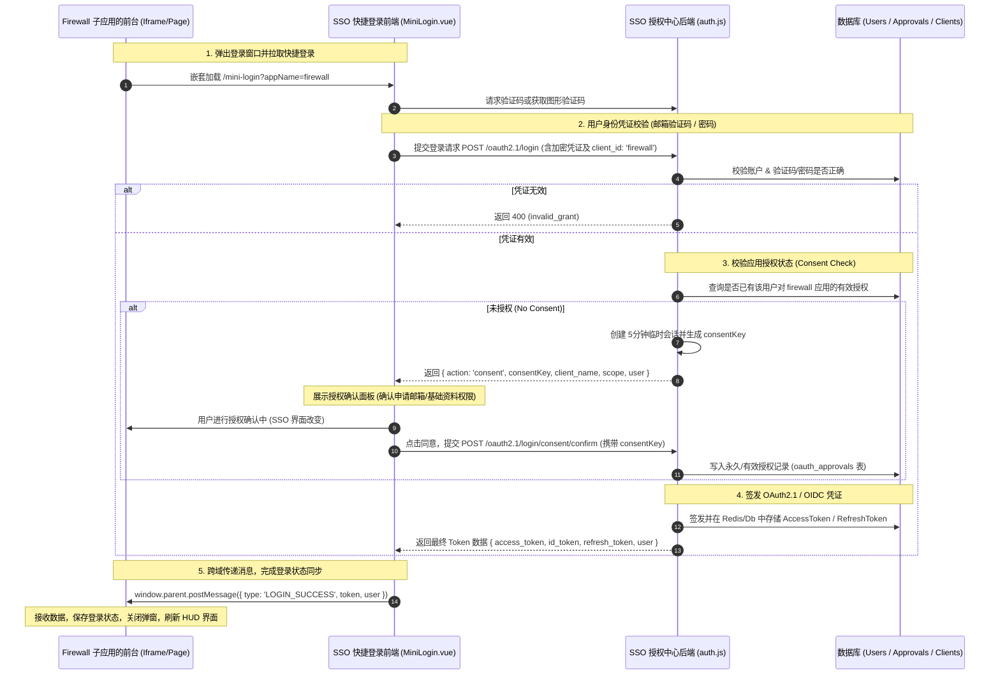
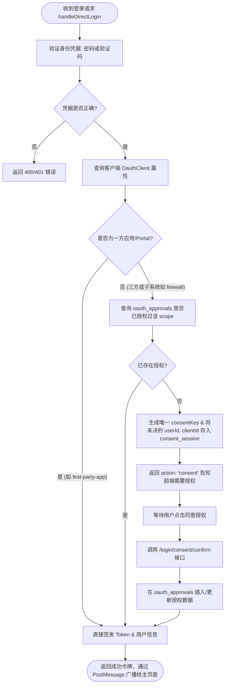

# OAuth 2.1 登录与授权流程架构 (Login & Consent Flow Architecture)

本文档阐明了系统中统一身份认证 (SSO) 与子应用 (以 Firewall 防火墙为例) 之间的快捷登录、单点登录以及动态授权流程。

## 1. 整体登录逻辑时序图 (SSO Login Flow)

---

## 2. 详细后端判断逻辑流程 (Backend Guard Flow)

---

## 3. 设计亮点与安全防范

1. **授权会话 (Consent Session)**:
   在需要用户点击同意授权时，没有直接让用户重新登录。因为如果是邮箱验证码登录，验证码是**一次性消费**的，第二次提交会直接失效。
   使用 `consentKey` 换取临时身份凭证，避免了让用户重新输入或重新发送验证码的糟糕体验，且 `consentKey` 仅限一次性使用且具有 5 分钟超时限制。

2. **多端平滑兼容**:
   在 `MiniLogin.vue` 中，当登录成功后同时广播：
   - `SSO_SUCCESS`：保证统一认证平台的第三方 OAuth/OIDC 默认客户端正常监听。
   - `LOGIN_SUCCESS`：与 Firewall 等需要快速同步 `user` 对象的精简 HUD 子应用完美对齐。
