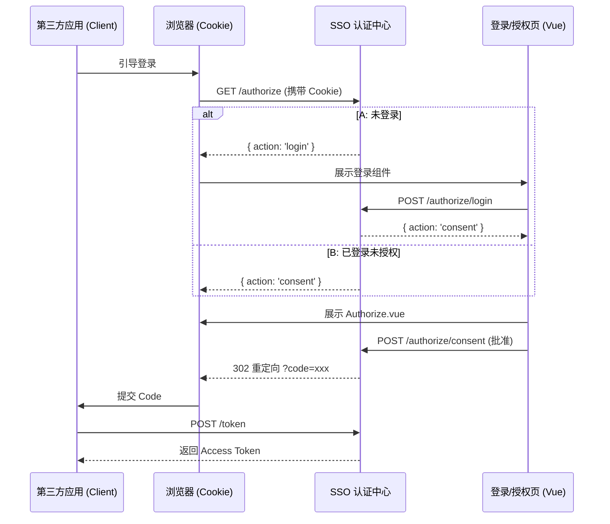

# SSO 授权登录深度技术解析

本手册旨在通过图解方式，深入剖析 SSO 认证中心与第三方应用（Client）之间的数据交互链路。

---

## 1. 核心业务流程图 (Detailed Sequence)

---

## 2. 状态逻辑判定

1. **CheckCookie**: 检查浏览器是否有 SSO 会话。
2. **CheckApproval**: 检查数据库 `oauth_approvals` 中 `status=1` 的记录。
3. **SilentFlow**: 若以上皆满足，直接重定向回应用。

---

## 3. 封禁逻辑
通过设置 `oauth_approvals.status = 0`，管理员可以立即终止特定用户对特定 App 的访问权。
