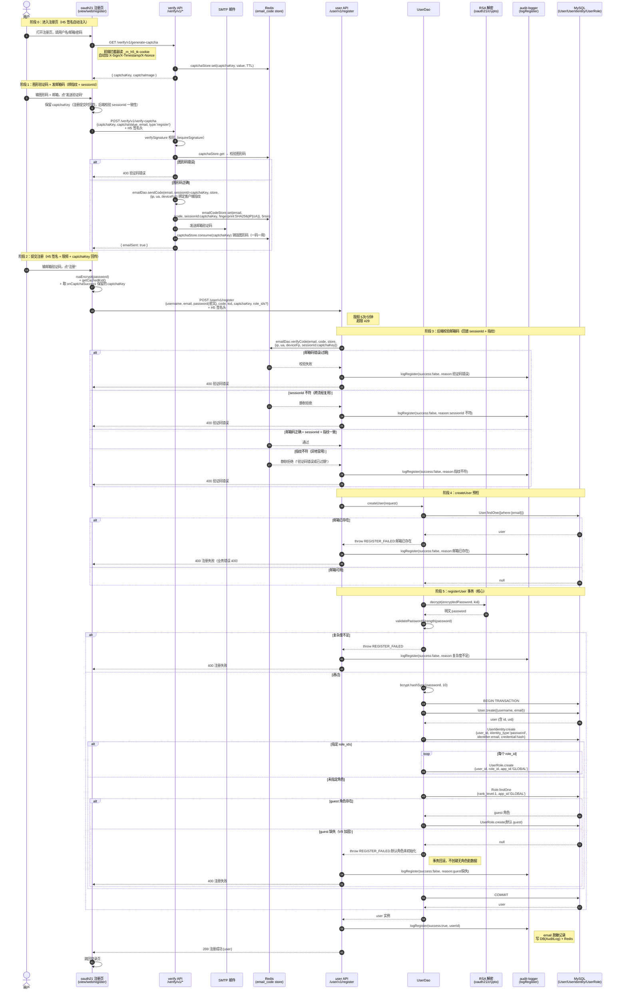
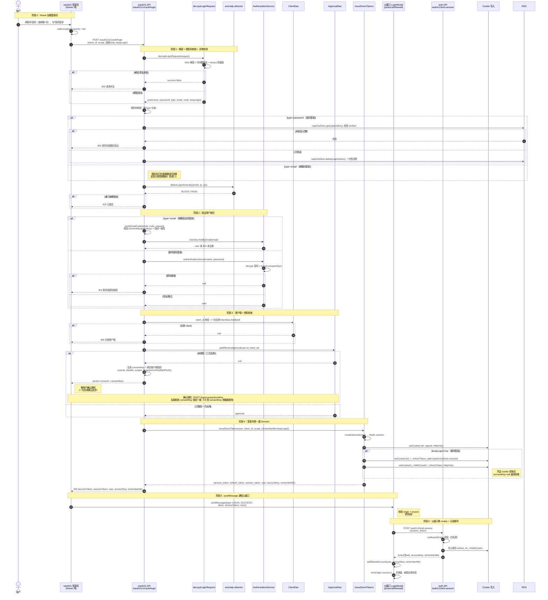
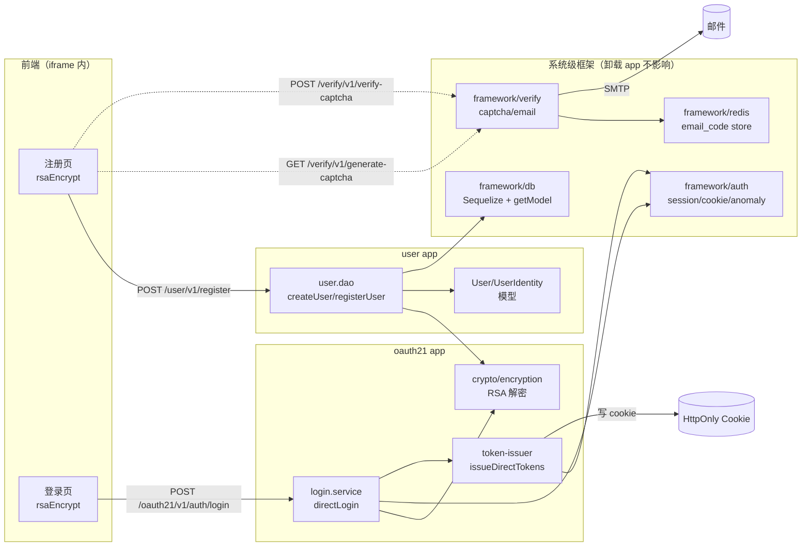
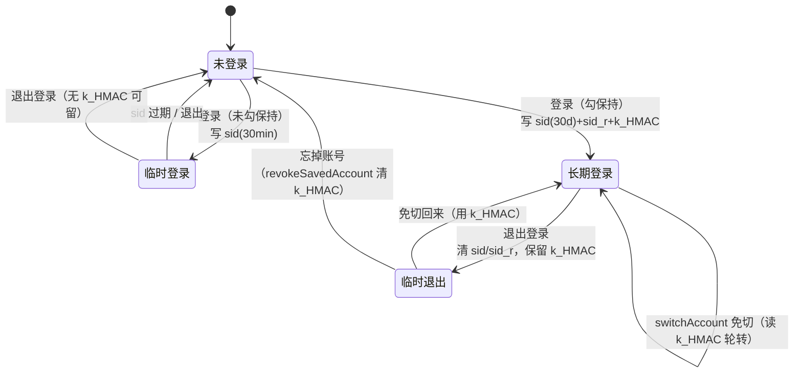
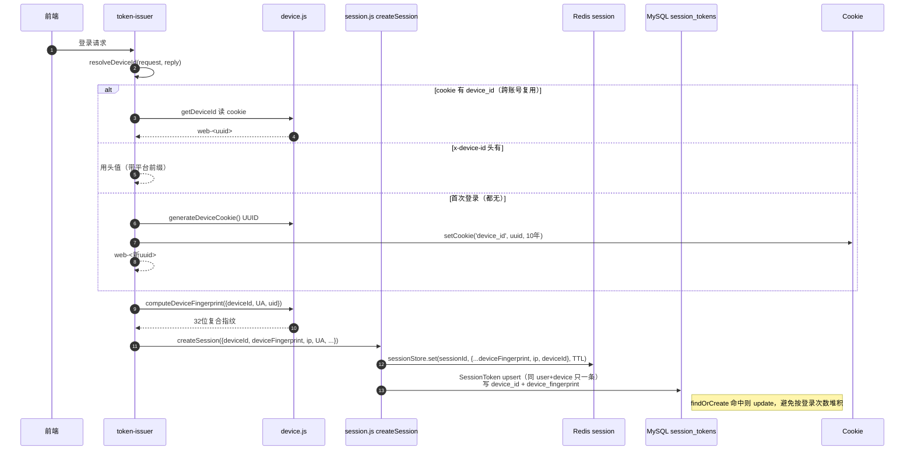
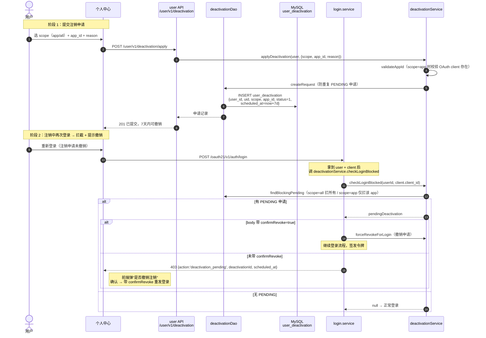
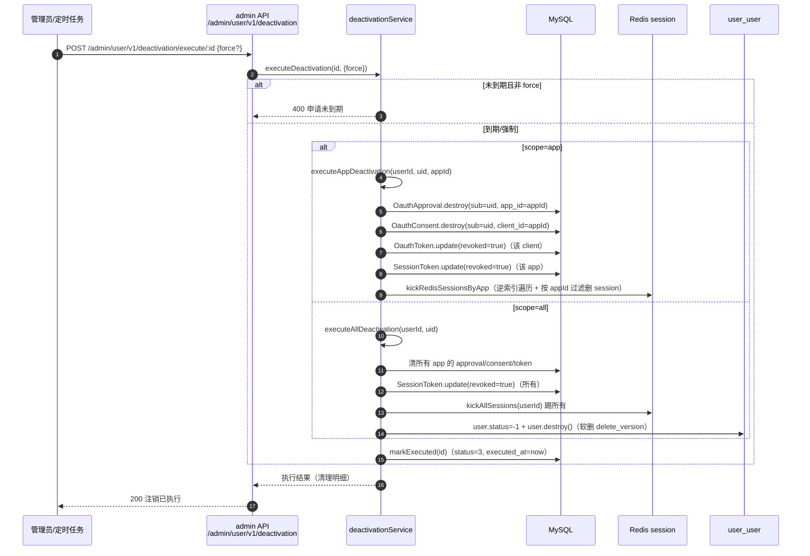
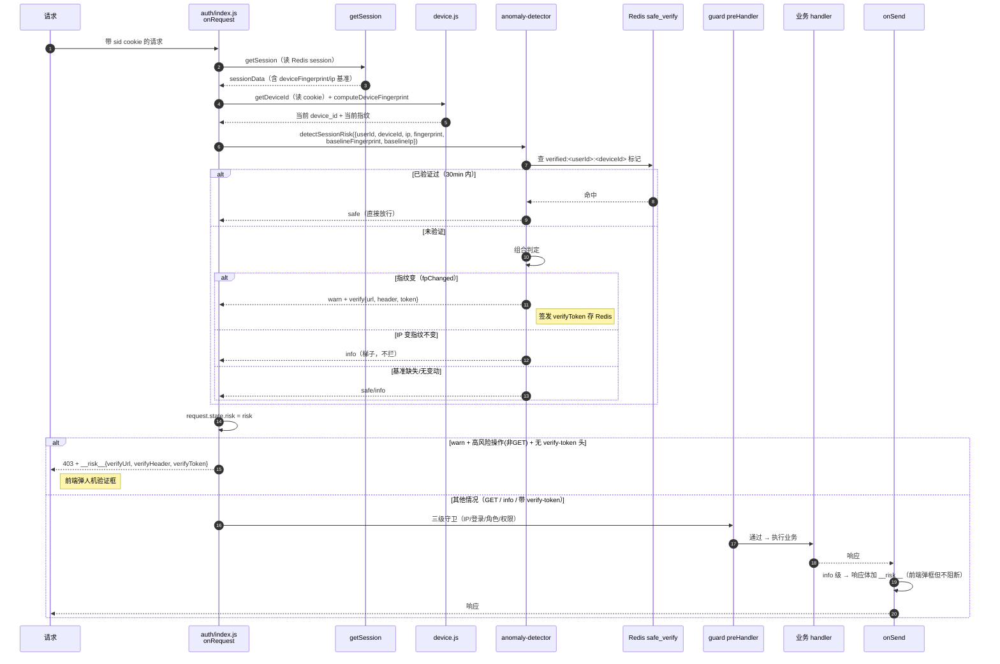
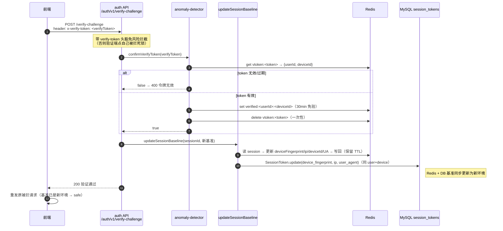
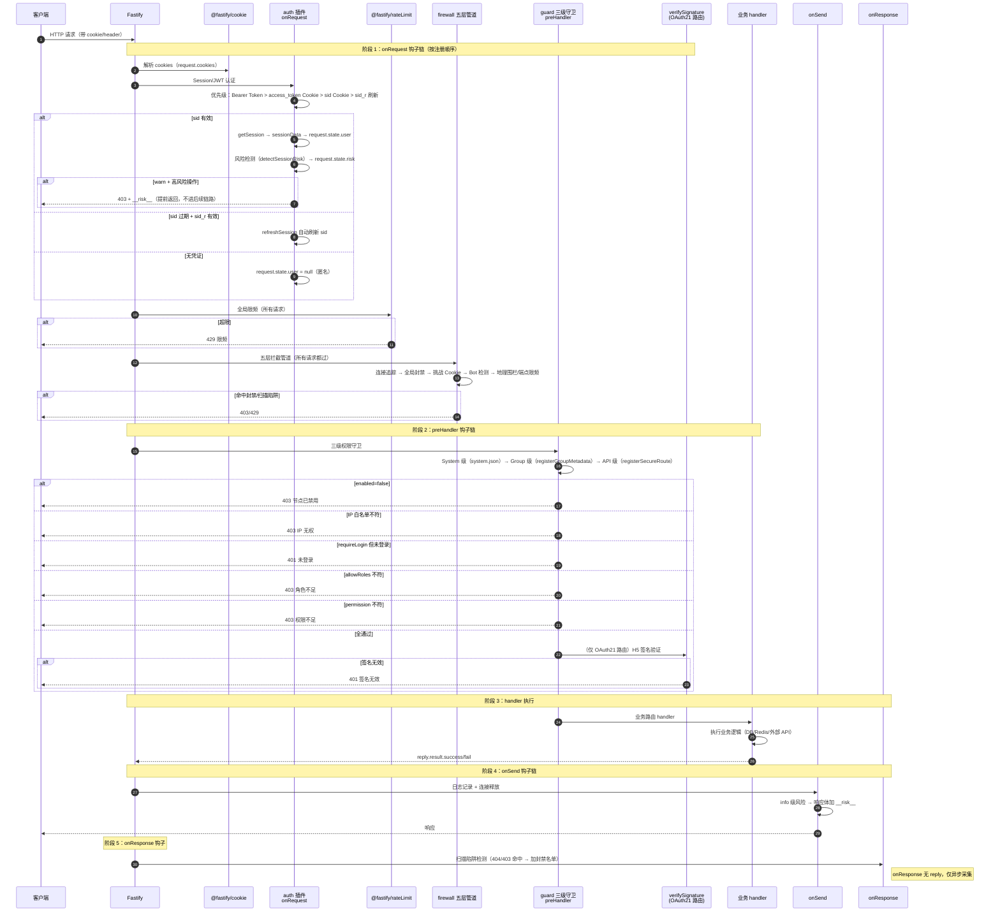

# 注册登录注销与请求处理全链路流程图

> 基于 oauth21 SSO 中心 + 系统级 auth 框架的实际代码追踪绘制。
> 涵盖：注册、登录、设备指纹、注销、访问风险检测、请求处理全链路。
> 注册端点：`POST /user/v1/register`（user 域）；登录端点：`POST /oauth21/v1/auth/login`（oauth21 域）。
> 两域共享：验证码（verify 域）、RSA 加解密（oauth21/crypto）、用户模型（user 域 DAO）。

---

## 一、注册全链路

### 1.1 注册时序图（前端 → 后端 → 数据库）



### 1.2 注册涉及的数据写入

| 表 | 字段 | 写入时机 | 说明 |
|---|---|---|---|
| `user_user` | username, email, uid(自动), status | 事务内 create | 用户基础信息，uid 为 UUID |
| `user_identity` | user_id, identity_type='password', identifier=email, credential=bcrypt哈希 | 事务内 create | 密码凭证，与 User 解耦 |
| `iam_user_role` | user_id, role_id, app_id='GLOBAL' | 事务内 create | 角色绑定，默认 guest（rank_level=1） |

**事务保证**：三张表同事务，任一失败全部回滚，不会出现"有用户无凭证"的脏数据。

---

## 二、登录验证全链路

### 2.1 登录时序图（iframe SSO 场景）



### 2.2 登录验证的安全检查点

| 阶段 | 检查项 | 实现位置 | 失败结果 |
|---|---|---|---|
| 解密 | RSA 签名 + 时间戳 + Nonce 防重放 | `decryptLoginRequest` | 400 请求非法 |
| 异常 | 暴力破解锁定（IP+账号维度） | `detectLoginAnomaly` | 429 已锁定 |
| 身份 | 密码 bcrypt 验证 / 邮箱码校验（绑 IP+UA 指纹 + sessionId 一致性） | `authenticateUser` / `verifyEmailCode` | 401/404，指纹/sessionId 不符静默拒绝 |
| 客户端 | client_id 有效性 | `ClientDao.findById` | 400 无效客户端 |
| 授权 | 用户是否授权该应用 + consentKey 绑客户端指纹 | `ApprovalDao.getEffectiveApproval` + `clientFingerprint` | 返回 consent 确认流程；confirm 指纹不符静默拒绝 |
| 来源 | bind-session 端点 Origin 白名单 | `isAllowedOrigin` | 403 来源不在允许列表 |
| 签名 | H5 签名验证（requireSignature） | `verifySignature` | 401 签名无效（无 _m_h5_tk cookie 首次放行并下发） |
| 限频 | 端点级 IP 限频 | `@fastify/rateLimit` | 429 限频 |
| postMessage | origin + source 双校验 | `LoginModal.handleMessage` | 静默丢弃 |

### 2.3 V1-V10 安全加固对照

| 加固 | 阶段 | 防护机制 |
|---|---|---|
| V1 | 注册提交 | requireSignature=true，防绕过前端直接灌水 |
| V2 | check-email | requireSignature + 限频 10次/分，防邮箱枚举 |
| V4 | 验证码 | 发码绑 IP+UA 指纹，用码回查，防异地冒用 |
| V5 | consent 授权 | consentKey 绑客户端指纹，confirm 校验，防冒用绕过确认 |
| V6 | 登录爆破 | detectLoginAnomaly 锁定 |
| V7 | postMessage | origin+source 双校验防伪造 |
| V8 | 注册审计 | logRegister 成功/失败全程记录（email 脱敏） |
| V9 | guest 角色 | 缺失抛错回滚，防无角色脏数据 |

### 2.4 验证码一次性消费链路（贯穿全流程）

**核心规则**：1 图形码 → 只发 1 次邮箱码；1 邮箱码 → 只登录或注册 1 次。

```
verify-captcha 发邮箱码：
  verify 图形码（标记 verified）→ 发邮箱码 → consume 删除图形码（一次性）
  → 邮箱码存 sessionId=captchaKey + 指纹

注册 /user/v1/register：
  emailDao.verifyCode 校验邮箱码 + sessionId(captchaKey) 一致 + 指纹
  → 通过 → delete 邮箱码（一次性，注册后不能复用登录）

登录 /oauth21/v1/auth/login：
  type=email：不校验图形码（已消费），verifyEmailCode 校验邮箱码 + sessionId + 指纹
              → 通过 → delete 邮箱码（一次性）
  type=password：校验图形码 verified → delete 图形码（一次性）
```

| 层 | 校验项 | 实现位置 | 防御目标 |
|---|---|---|---|
| 1. 图形码 | verify + 一次性 consume | `captcha/dao.js verifyAndSendEmail`（发码时删）+ `login.service`（密码登录时删）| 防机器人 + 防图形码复用 |
| 2. 邮箱码正确性 | code === info.code | `email/dao.js verifyCode` | 防瞎猜 |
| 3. sessionId 一致性 | captchaKey 回查 | `email/dao.js verifyCode` | 防跨流程复用 |
| 4. 客户端指纹 | IP+UA（+device 启用时）回查 | `email/dao.js fingerprint` | 防异地冒用 |
| 5. 一次性消费 | store.delete（图形码 + 邮箱码各一次）| `verifyAndSendEmail` + `verifyCode` + `login.service` | 防重放 |

> 注：`/verify/v1/check-email-code` 端点会消费邮箱码，注册流程勿在 register 前调用。
> 登录与注册逻辑一致：均校验邮箱码 + sessionId + 指纹 + 一次性消费。

---

## 三、注册与登录的共享依赖



**关键边界**：
- **注册**走 user 域（`/user/v1/register`），用 user.dao + oauth21/crypto 的 RSA 解密
- **登录**走 oauth21 域（`/oauth21/v1/auth/login`），用 login.service + token-issuer + framework/auth
- **验证码**走 verify 域（`/verify/v1/*`），注册和登录共用，存 Redis email_code store
- **RSA 解密**是 oauth21/crypto 提供的共享能力，user.dao 和 login.service 都依赖它

---

## 四、Cookie 与凭证状态流转



**Cookie 生命周期**：
| Cookie | 临时登录 | 长期登录 | 临时退出 | 忘掉账号 |
|---|---|---|---|---|
| `sid` | 30min | 30d | 清 | 清 |
| `sid_r` | 无 | 30d（path 收窄） | 清 | 清 |
| `k_<HMAC(uid)>` | 无 | 180d | **保留** | 清 |

---

## 五、设备码 + 复合指纹链路

> 设备识别是"同设备同用户只一条 session_token"和"访问风险检测"的基础。

### 5.1 两个值的区别

| 值 | 来源 | 稳定性 | 作用 |
|---|---|---|---|
| `device_id` | cookie `device_id`（首次登录生成 UUID，跨账号复用） | 跨浏览器版本/账号稳定 | session_token 幂等键（同 user+device 只一条） |
| `device_fingerprint` | `sha256(device_id + UA + uid)` 算出 | 绑设备+账号，换设备/换账号即变 | 访问风险检测基准（基准在 Redis session 里） |

### 5.2 登录时设备码写入流程



### 5.3 关键设计

- **cookie device_id 跨账号复用**：同一浏览器登录过 A 账号写过 cookie，退出再登录 B 账号时复用同一 device_id（设备不变）
- **session_tokens 表幂等**：`findOrCreate({user_id, device_id})` 命中 update 不 create，同设备同账号始终一条
- **基准写 Redis**：`device_fingerprint` 存 session 数据里，访问时 `getSession` 直接取，零 DB 查询
- **DB session_tokens 同步**：登录时 upsert 写入，作为持久备份（访问检测不依赖它）

---

## 六、用户注销全链路

> 注销流程：申请 → 拒登录（7天撤销期）→ 到期正式执行。
> scope=app：清该 app 的 OAuth 授权 + 吊销该 app session；scope=all：清所有 + 软删 user_user。

### 6.1 注销申请 + 拦截登录时序



### 6.2 正式执行注销（管理员/到期触发）



### 6.3 注销数据清理范围

| scope | OAuth 授权 | session | user_user |
|---|---|---|---|
| `app` | 该 app 的 approval/consent/token | 该 app 的 session_tokens + Redis | 不动 |
| `all` | 所有 app 的 approval/consent/token | 所有 session + Redis | 软删（status=-1, delete_version） |

---

## 七、访问风险检测全链路

> 每次请求比对当前 device_id/IP/UA 与 Redis session 里的基准，指纹突变弹人机验证，IP 变（梯子）不拦。

### 7.1 风险检测时序



### 7.2 风险规则与处理矩阵

| 检测结果 | 触发条件 | GET 读操作 | 高风险操作(写) |
|---|---|---|---|
| `safe` | 已验证 / 基准缺失 / 都没变 | 放行 | 放行 |
| `info` | IP 变指纹不变（梯子）/ 基准缺失 | 放行 + 响应带 `__risk__` | 放行 + 响应带 `__risk__` |
| `warn` | 指纹变（换设备/UA） | 放行 + 响应带 `__risk__` | **403 拦截** + 验证链接 |

### 7.3 人机验证 + 基准更新流程



### 7.4 防误杀设计要点

| 场景 | 判定 | 处理 | 防误杀依据 |
|---|---|---|---|
| 换设备登录 | 指纹变 | warn，写操作拦 | 账号被盗高风险，必须验证 |
| 同设备换账号 | device_id 不变，指纹变（uid 变） | warn | 正常行为，但该账号首次访问需验证基准 |
| 梯子/IP 变 | IP 变指纹不变 | info，不拦 | 梯子常见，拦则误杀大量正常用户 |
| 浏览器更新 | UA 变 → 指纹变 | warn | 误杀风险，但有 cookie device_id 兜底（基准从 Redis 取，UA 变不影响 device_id） |
| 旧 session 无指纹字段 | 基准缺失 | info | 登录早于功能上线，降级放行不误判 |

---

## 八、请求处理全链路

> 从 HTTP 请求进入到响应返回的完整链路：onRequest 认证 → preHandler 守卫 → handler → onSend → onResponse。

### 8.1 请求处理时序图



### 8.2 onRequest 钩子顺序与职责

| 顺序 | 钩子 | 职责 | 失败结果 |
|---|---|---|---|
| 1 | `@fastify/cookie` | 解析 cookies 到 `request.cookies` | — |
| 2 | `auth` | Session/JWT 认证 → `request.state.user`；风险检测 → `request.state.risk` | 403（warn+高风险） |
| 3 | `@fastify/rateLimit` | 全局 IP 限频 | 429 |
| 4 | `firewall` | 五层拦截（限频/封禁/挑战/Bot/地理围栏） | 403/429 |

### 8.3 三级守卫层级（preHandler）

| 级别 | 来源 | 配置项 | 作用范围 |
|---|---|---|---|
| System | `system.json` | `enabled, allowIps, requireLogin` | 整个 API 域 |
| Group | `registerGroupMetadata()` | `enabled, allowIps, allowRoles` | 一组路由 |
| API | `registerSecureRoute()` | `enabled, allowIps, allowRoles, requireLogin, permission` | 单个路由 |

**校验链**：每级独立执行 `applyGuardLogic`（enabled → IP 白名单 → 登录态+角色 → 权限），任一级拦截即 403/401。

### 8.4 风险拦截在请求链路中的位置

```
请求进入
  │
  ├─ onRequest: auth 认证 + 风险检测
  │    ├─ warn + 高风险操作(POST/PUT/DELETE) + 无 verify-token 头 → 403 拦截（在此终止）
  │    ├─ info / warn+GET → request.state.risk 记录，继续
  │    └─ safe → 继续
  │
  ├─ onRequest: rateLimit 限频
  ├─ onRequest: firewall 五层拦截
  │
  ├─ preHandler: guard 三级守卫（IP/登录/角色/权限）
  ├─ preHandler: verifySignature（仅 OAuth21 路由）
  │
  ├─ handler: 业务逻辑
  │
  ├─ onSend: 日志 + 风险信息注入响应体（info 级加 __risk__）
  │
  └─ onResponse: 扫描陷阱检测（404/403 命中 → 异步加封禁名单）
```

**设计要点**：
- 风险检测在 auth onRequest 阶段（最早），warn+高风险操作直接 403，不进守卫/handler，性能最优
- info 级不拦，但 onSend 注入 `__risk__` 到响应体，前端弹框（不阻断读操作）
- 验证端点带 `x-verify-token` 头豁免风险拦截（否则验证端点 POST 自己被拦，死锁）
- onResponse 只做异步采集（扫描陷阱），无 reply，不影响响应

### 8.5 各阶段 reply 能力

| 阶段 | 能否提前返回 | 典型用途 |
|---|---|---|
| onRequest | ✅ `reply.send()` 终止链路 | 认证失败/风险拦截/限频 |
| preHandler | ✅ `reply.send()` 终止链路 | 守卫拦截/签名失败 |
| handler | ✅ 正常返回 `reply.result.*` | 业务响应 |
| onSend | ⚠️ 可改 payload 但不建议终止 | 修改响应体（加 `__risk__`） |
| onResponse | ❌ 无 reply，仅异步采集 | 扫描陷阱/统计 |
