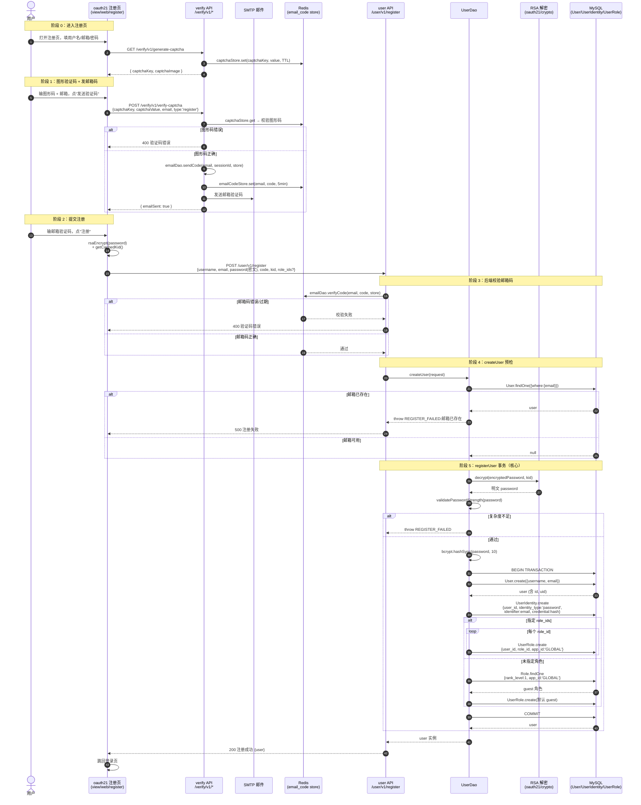
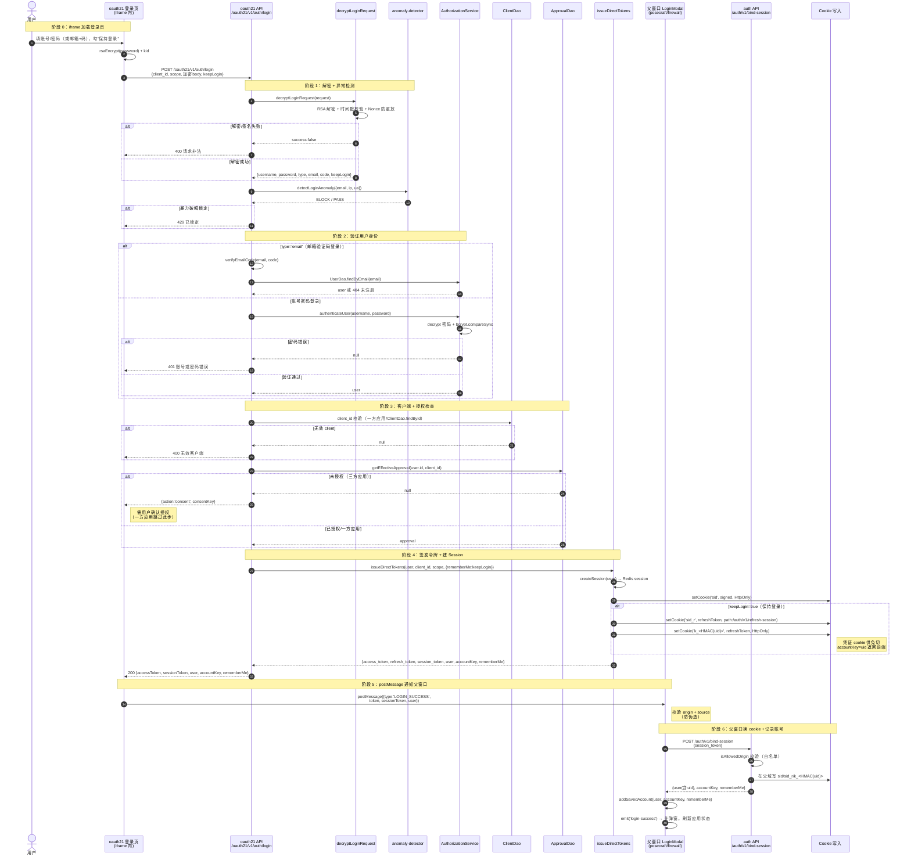
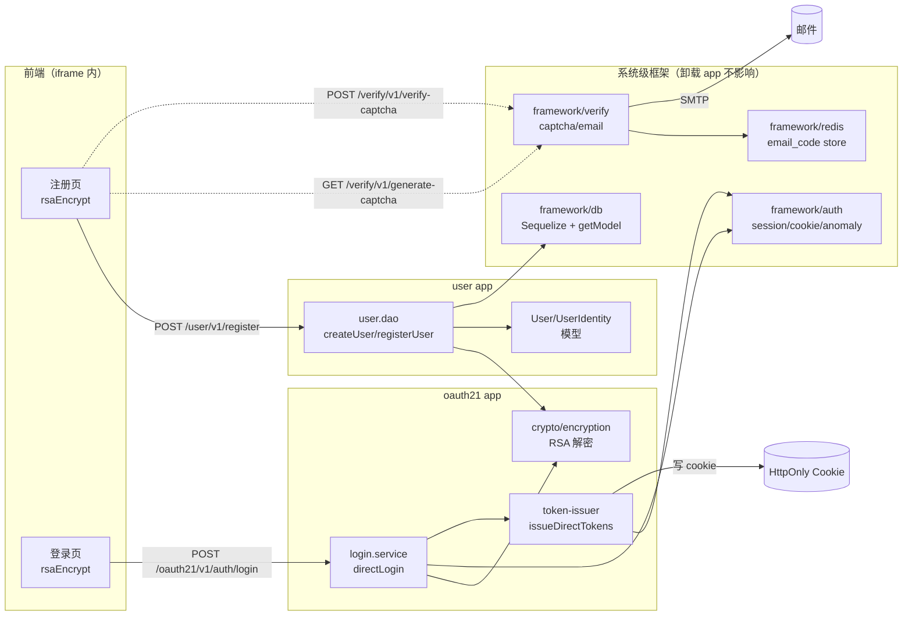
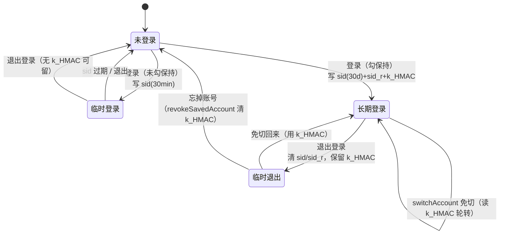

# 注册登录验证全链路流程图

> 基于 oauth21 SSO 中心 + 系统级 auth 框架的实际代码追踪绘制。
> 注册端点：`POST /user/v1/register`（user 域）；登录端点：`POST /oauth21/v1/auth/login`（oauth21 域）。
> 两域共享：验证码（verify 域）、RSA 加解密（oauth21/crypto）、用户模型（user 域 DAO）。

---

## 一、注册全链路

### 1.1 注册时序图（前端 → 后端 → 数据库）

### 1.2 注册涉及的数据写入

| 表 | 字段 | 写入时机 | 说明 |
|---|---|---|---|
| `user_user` | username, email, uid(自动), status | 事务内 create | 用户基础信息，uid 为 UUID |
| `user_identity` | user_id, identity_type='password', identifier=email, credential=bcrypt哈希 | 事务内 create | 密码凭证，与 User 解耦 |
| `iam_user_role` | user_id, role_id, app_id='GLOBAL' | 事务内 create | 角色绑定，默认 guest（rank_level=1） |

**事务保证**：三张表同事务，任一失败全部回滚，不会出现"有用户无凭证"的脏数据。

---

## 二、登录验证全链路

### 2.1 登录时序图（iframe SSO 场景）

### 2.2 登录验证的安全检查点

| 阶段 | 检查项 | 实现位置 | 失败结果 |
|---|---|---|---|
| 解密 | RSA 签名 + 时间戳 + Nonce 防重放 | `decryptLoginRequest` | 400 请求非法 |
| 异常 | 暴力破解锁定（IP+账号维度） | `detectLoginAnomaly` | 429 已锁定 |
| 身份 | 密码 bcrypt 验证 / 邮箱码校验 | `authenticateUser` / `verifyEmailCode` | 401/404 |
| 客户端 | client_id 有效性 | `ClientDao.findById` | 400 无效客户端 |
| 授权 | 用户是否授权该应用 | `ApprovalDao.getEffectiveApproval` | 返回 consent 确认流程 |
| 来源 | bind-session 端点 Origin 白名单 | `isAllowedOrigin` | 403 来源不在允许列表 |
| postMessage | origin + source 双校验 | `LoginModal.handleMessage` | 静默丢弃 |

---

## 三、注册与登录的共享依赖

**关键边界**：
- **注册**走 user 域（`/user/v1/register`），用 user.dao + oauth21/crypto 的 RSA 解密
- **登录**走 oauth21 域（`/oauth21/v1/auth/login`），用 login.service + token-issuer + framework/auth
- **验证码**走 verify 域（`/verify/v1/*`），注册和登录共用，存 Redis email_code store
- **RSA 解密**是 oauth21/crypto 提供的共享能力，user.dao 和 login.service 都依赖它

---

## 四、Cookie 与凭证状态流转

**Cookie 生命周期**：
| Cookie | 临时登录 | 长期登录 | 临时退出 | 忘掉账号 |
|---|---|---|---|---|
| `sid` | 30min | 30d | 清 | 清 |
| `sid_r` | 无 | 30d（path 收窄） | 清 | 清 |
| `k_<HMAC(uid)>` | 无 | 180d | **保留** | 清 |
