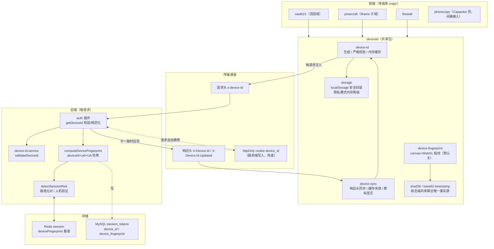
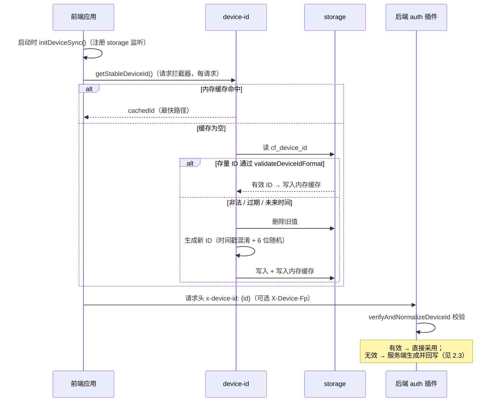
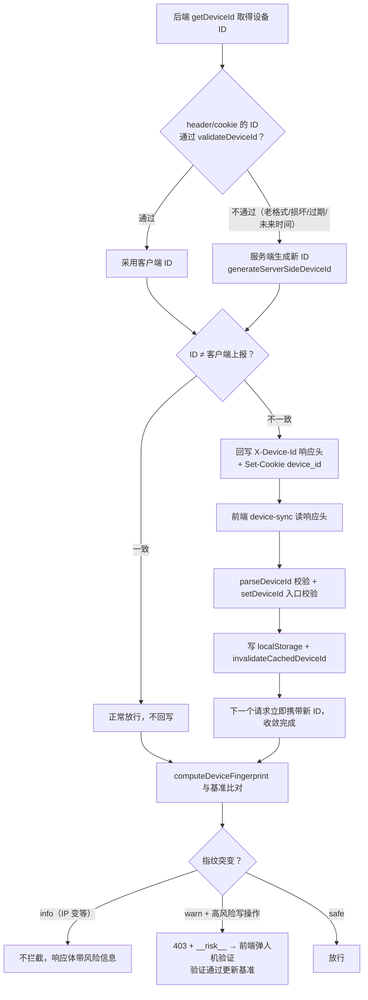
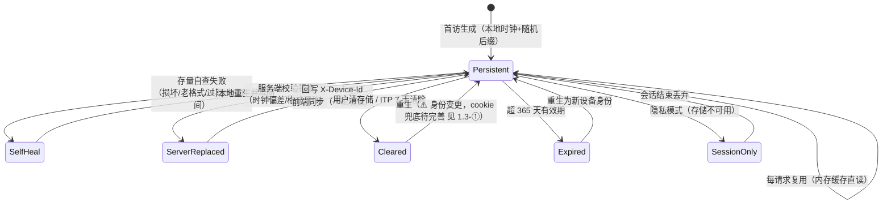

# 设备 ID 稳定性评估与架构图

> 配套文档：[设备ID全链路梳理.md](./设备ID全链路梳理.md)（链路细节与已知问题清单）。
> 本文聚焦一个问题：**device_id 是否足够稳定、什么情况下会变、如何进一步收敛变动**。
> 评估基线：`12fa5a8`（共享包完整开发后）；1.3-①②③ 均已于 2026-09-05 实施。

## 一、稳定性评估结论

**结论：设计上"一次生成、终身复用"的稳定性目标基本达成，可工程收敛的变动场景（cookie 兜底、时钟容差、跨 origin 归一）已全部实施，仅存隐私模式与设计性过期两类不可避免场景。**

### 1.1 稳定性达标的部分 ✅

| 保障 | 实现位置 | 说明 |
| --- | --- | --- |
| 持久化 | `device-id.js` localStorage（key `cf_device_id`） | 不随登出/换账号清除，跨账号复用 |
| 内存缓存 | `getStableDeviceId` 模块级 `cachedId` | 每请求读内存而非存储，杜绝读路径漂移 |
| 缓存一致性 | `invalidateCachedDeviceId` 写后失效 | 服务端下发新 ID 后下一请求即生效（12fa5a8 修复） |
| 存量自查 | `validateDeviceIdFormat` 与后端逐条对齐 | 非法/过期 ID 本地即重生，不会带着坏 ID 反复请求 |
| 服务端收敛 | `auth/index.js:258` 校验不一致时回写 `X-Device-Id` | 客户端 ID 无效只损失一轮往返，之后稳定（防死循环注释在案） |
| 随机质量 | `crypto.getRandomValues` + 拒绝采样 | 6 字符 Base62 ≈ 35.7bit 熵 + 毫秒时间戳，碰撞概率 < 10^-15 |
| 变更审计 | `session_tokens` 以 token 为锚点更新 device_id | ID 变更不新增设备行、不留 orphan |

### 1.2 ID 会变动的场景（按影响排序）

| # | 场景 | 是否可避免 | 现状 |
| --- | --- | --- | --- |
| S1 | 用户清除浏览器数据 / localStorage 被清 | 不可（存储本质） | 重生新 ID，后端按新设备处理；httpOnly `device_id` cookie 有机会兜底，但见 1.3-① |
| S2 | Safari ITP 7 天清除脚本可写存储 | 部分可 | 同 S1，且 Safari 用户**最多每 7 天换一次身份**，是移动端最大的不稳定源，见 1.3-① |
| S3 | 隐私模式 / 存储被禁 | 不可 | 会话内临时 ID，刷新即变（已知限制 P2.8，console.warn 告警） |
| S4 | 365 天有效期到期 | 设计使然 | 到期重生 = 换设备身份，旧设备行成孤儿（P2.7 清理任务覆盖中） |
| S5 | 跨浏览器 / 跨设备 / 跨 origin | 设计使然 | 每 origin 一份独立 ID（见 1.3-②），同物理设备在系统内有 N 个身份 |

### 1.3 可完善点（①③ 于 2026-09-05 实施，② 同日实施）

① **S1/S2：cookie 兜底被"抢先重生"架空（✅ 已实施 2026-09-05，纯后端小改）**

链路上 httpOnly `device_id` cookie 由服务端 Set-Cookie 写入（`device.js:126`），
**不受 ITP 7 天清除影响**（ITP 只清脚本可写存储）。但当前时序是：

- localStorage 被清 → 前端 `getStableDeviceId()` **立即生成新 ID**（本地校验通过的有效 ID）
- 请求头 `x-device-id` 携带新 ID，**优先级高于 cookie**（`device.js:85`）
- 后端校验新 ID 合法 → 直接采纳 → cookie 被覆盖 → **旧设备身份永久丢失**

cookie 兜底机制实际永远不会生效。~~**建议**：`getDeviceId` 中当 header ID 的
`createdAt` 距今极近（如 < 10s，表明是刚生成的）且 cookie 中存在**合法**的
不同 ID 时，优先采纳 cookie ID 并回写 `X-Device-Id` 让前端同步回 localStorage。~~
**✅ 已实施（2026-09-05）**：`device.js getDeviceId` 新增恢复分支——header ID 在
`REBORN_WINDOW_MS`（10s）内生成或不可解析、且 cookie 存有合法的不同 ID 时，
优先恢复 cookie 身份，由调用方回写 `X-Device-Id` 让前端同步回 localStorage。
Safari 7 天清除、手动清缓存两种场景均保持身份连续。测试：
`src/__tests__/framework/auth/device.test.js`（8 用例）。

② **S5：跨 origin 身份分裂（✅ 已实施 2026-09-05）**

localStorage 按 origin 隔离：oauth21（顶层）、posecraft/firewall（iframe 内）各自持有
device_id，后端把同一物理设备记为多个设备。**已实施归一**：登录成功时 oauth21 在
`LOGIN_SUCCESS` postMessage 中附带权威域 device_id（`useLoginFlow.notifyParentLoginSuccess`
单点注入，覆盖直接登录 / Consent 授权 / 邮箱二次验证三条路径），父窗口在
**bindSession 之前**调用共享包 `adoptDeviceId` 采纳——绑定请求即携带统一 ID，
登录基准指纹与后续请求一致，无风险误报窗口。安全链路复用既有基建：
oauth21 侧 `postToParent` 父 origin 白名单（`VITE_ALLOWED_PARENT_ORIGINS` +
ancestorOrigins），父窗口侧 `event.origin + event.source` 双重校验，采纳前还有
`validateDeviceIdFormat` + 平台段与本机 UA 一致性双校验（共享包内聚，伪造/损坏
消息直接拒绝且不改变本地状态）。**注意**：归一发生在登录时；已登录会话的存量
per-origin ID 保持到下次登录才归一。测试：`device-sync.test.js` adoptDeviceId 4 用例。
**账户关联扩展点**：管理端已提供 `GET /admin/user/v1/devices/accounts?deviceId=`
（`device-account.service.js`），按 device_id 反查登录过的账户列表（uid 集合 +
loginCount + 活跃会话标记），后续账户关联功能可直接基于该响应建立关联关系。

③ **时钟偏差的替换轮次（✅ 已实施 2026-09-05）**

本机时钟超前服务器时，本地生成的 ID 对后端是"未来时间"被拒 → 服务端生成替换
ID 回写，一轮收敛后稳定。**已实施**：后端 `validateDeviceId` 与前端
`validateDeviceIdFormat` 均对未来时间给予 ±5 分钟容差（常量
`CLOCK_SKEW_TOLERANCE_MS` 两端同值），消除微小偏差下的一次性替换往返；
后端 `ageDays` 同步钳为非负。

④ **多标签页首访竞态（可不做）**

两标签页同时首访各自生成 ID，后写覆盖先写，storage 事件已同步，仅浪费一轮
收敛。`initDeviceSync` 监听 + 写后失效缓存已把影响降到最小，不值得加复杂度。

## 二、架构图

### 2.1 全链路架构（分层）

### 2.2 请求注入流程（每请求）

### 2.3 响应同步与自愈收敛流程

### 2.4 设备 ID 生命周期状态图

## 三、一句话总结

**设备 ID 的稳定性由"持久化 + 内存缓存 + 双端同规则校验 + 一轮收敛的自愈"四层
保障，正常使用下终身不变；剩余的变动源集中在存储被清（S1/S2/S3）与设计性过期
（S4），其中 cookie 兜底被抢先重生架空（1.3-①）是当前性价比最高的完善点。**
