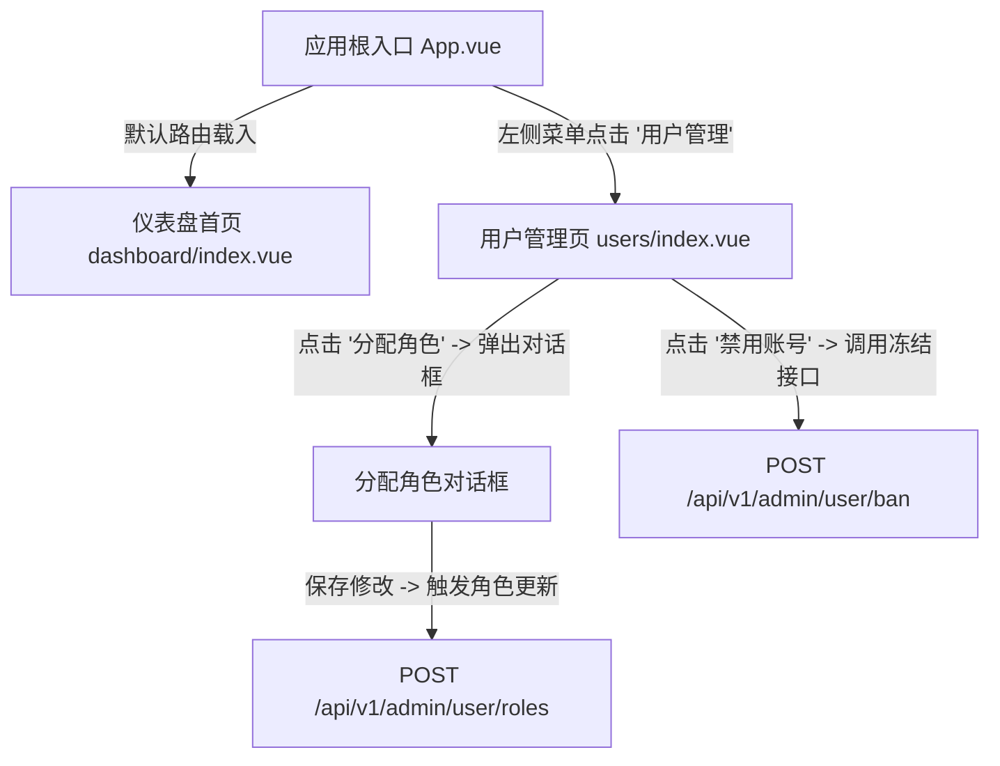

# Admin 前端页面流转与交互关系图 (User Flow & Interactions)

本文件使用 Mermaid.js 拓扑连线图定义了平台后台管理系统 `admin` 的页面与交互流转关系。

---

## 1. 全景页面连线图 (Flowchart)

---

## 2. 核心功能及交互提示 (Functional Tooltips)

- **平台仪表盘 (`dashboard/index.vue`)**：
  - _功能_：用于展示当前核心业务的运营数据大盘，包括累计注册用户数、活跃会话数、请求限频拦截数以及 Redis 缓存健康状态。
- **用户管理页 (`users/index.vue`)**：
  - _功能_：实现对平台全部用户身份的审计控制。管理员可以查看用户的注册时间、最后活动 IP，并在弹出框中调整其 PBAC 角色和特权。
