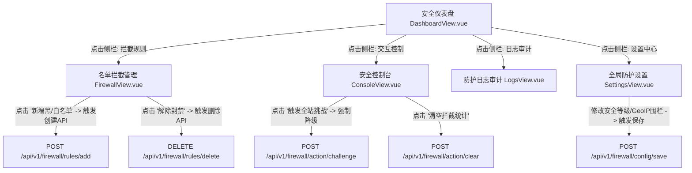

# Firewall 前端页面流转与交互关系图 (User Flow & Interactions)

本文件使用 Mermaid.js 拓扑连线图定义了防火墙平台 `firewall` 前端的所有控制页面流转和核心 API 交互逻辑。

---

## 1. 全景页面连线图 (Flowchart)

---

## 2. 核心功能及交互提示 (Functional Tooltips)

- **安全仪表盘 (`DashboardView.vue`)**：
  - _功能_：实时统计并渲染防火墙拦截的流量环形图（QPS 监控、Bot 攻击数、IP 区域分布）。
- **名单拦截管理 (`FirewallView.vue`)**：
  - _功能_：对 IP 白名单和黑名单进行增删改查。当防火墙误拦某 IP 时，管理员可在此快速将该 IP 解除封禁或加入白名单。
- **安全控制台 (`ConsoleView.vue`)**：
  - _功能_：提供应急响应下的防御操作（例如一键对全站所有未登录请求开启五层人机识别验证码挑战）。
