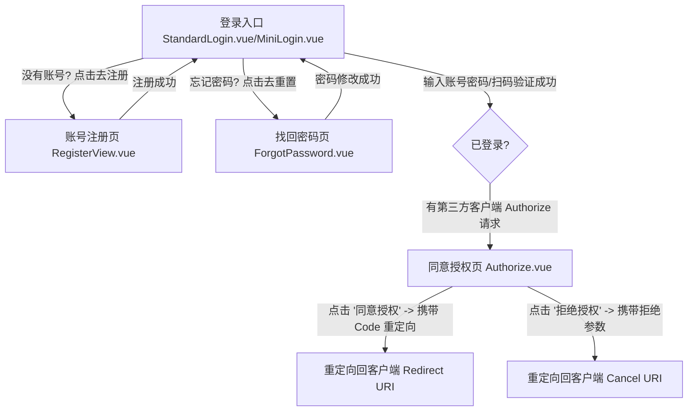

# OAuth 2.1 鉴权中心页面流转与交互关系图 (User Flow & Interactions)

本文件使用 Mermaid.js 拓扑连线图定义了 `oauth21` (鉴权中心) 前端的所有页面流转与认证/授权逻辑。

---

## 1. 全景页面连线图 (Flowchart)

---

## 2. 核心功能及交互提示 (Functional Tooltips)

*   **登录入口 (`StandardLogin.vue`/`MiniLogin.vue`)**：
    *   *功能*：提供标准的用户名密码登录，同时支持基于 H5 签名的防爬虫防刷机制。可由第三方客户端发起授权时唤起。
*   **同意授权页 (`Authorize.vue`)**：
    *   *功能*：这是 OAuth 2.1 中的核心用户交互页面。展示第三方应用所申请的 Scope 范围权限（如 openid, profile, email），并在用户确认后，向后端请求授权码（Authorization Code），最后重定向回客户端的回调地址。
