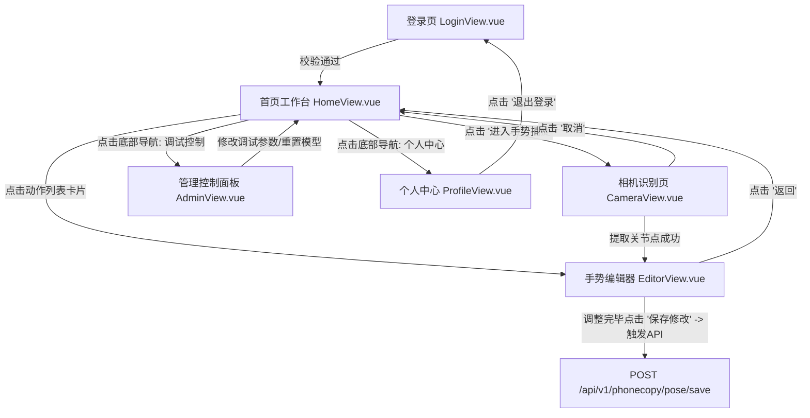

# PhoneCopy 移动端 H5 页面流转与交互关系图 (User Flow & Interactions)

本文件使用 Mermaid.js 拓扑连线图定义了移动预览与手势提取端 `phonecopy` 前端的所有页面流转与交互逻辑。

---

## 1. 全景页面连线图 (Flowchart)

---

## 2. 核心功能及交互提示 (Functional Tooltips)

- **相机识别页 (`CameraView.vue`)**：
  - _功能_：专门面向移动设备（如手机摄像头）进行调优。使用轻量级的 MediaPipe 神经网络提取手指及身体的各部位骨骼点信息。
- **手势编辑器 (`EditorView.vue`)**：
  - _功能_：用于微调手指关节弯曲度或握拳角度等小细节，并在界面上实时计算预览结果。内置了从 public/ 懒加载的权重文件数据交互。
- **管理控制面板 (`AdminView.vue`)**：
  - _功能_：供移动端测试和设备配对调试使用，展示传感器帧率、识别置信度阈值等元参数。
