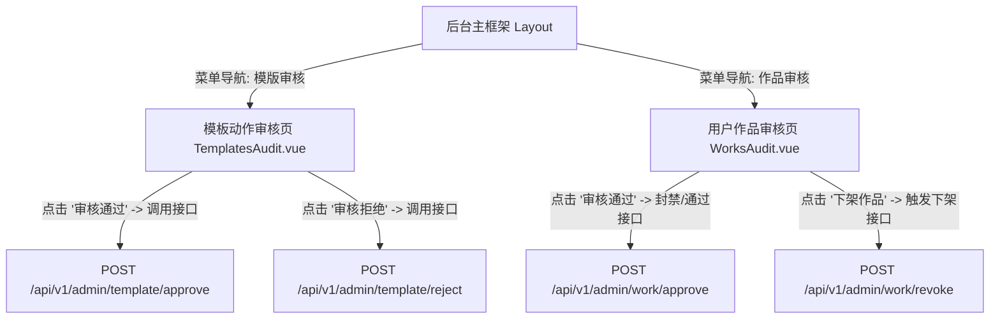

# PoseAdmin 前端页面流转与交互关系图 (User Flow & Interactions)

本文件使用 Mermaid.js 拓扑连线图定义了 `poseadmin` (后台动作审核平台) 的页面管理流转与接口交互逻辑。

---

## 1. 全景页面连线图 (Flowchart)

---

## 2. 核心功能及交互提示 (Functional Tooltips)

- **模板动作审核页 (`TemplatesAudit.vue`)**：
  - _功能_：展示待上架的动作模板（包含预览骨骼图和特征参数），管理员可对其进行一键批量审核或驳回。
- **用户作品审核页 (`WorksAudit.vue`)**：
  - _功能_：列表加载社区用户公开发表的动作作品。当收到举报或检测到不合规动作时，管理员在此页进行强行下架或账号预警控制。
