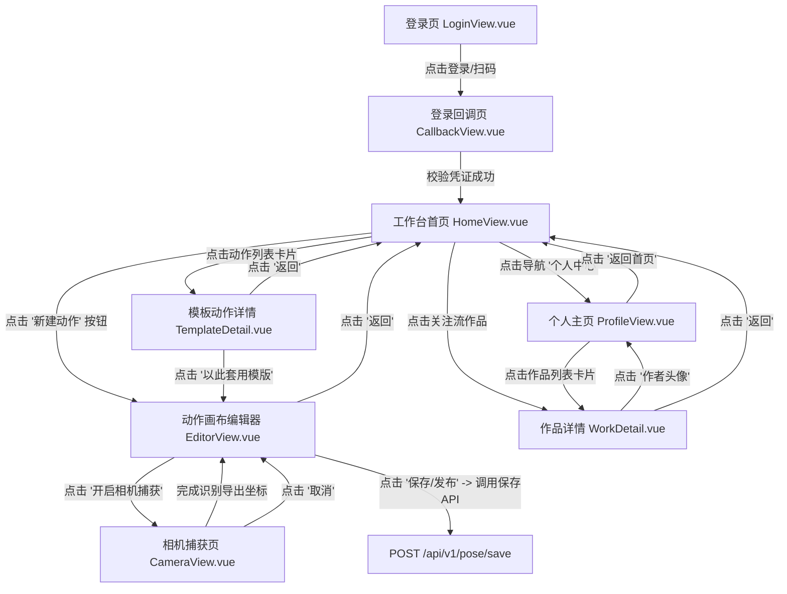

# PoseCraft 前端页面流转与交互关系图 (User Flow & Interactions)

本文件使用 Mermaid.js 拓扑连线图定义了 `posecraft` (动作捕获工作台) 前端的所有页面流转与核心 API 交互逻辑，供 AI 和开发者进行功能边界分析。

---

## 1. 全景页面连线图 (Flowchart)

---

## 2. 核心功能及交互提示 (Functional Tooltips)

*   **工作台首页 (`HomeView.vue`)**：
    *   *功能*：聚合了推荐动作模版列表、用户个人近期动作以及关注作者的作品流。
    *   *跳转*：点击模版进入详情，点击新建进入空白画布，点击关注作品进入播放详情。
*   **动作画布编辑器 (`EditorView.vue`)**：
    *   *功能*：支持二维人体骨骼点（关节）的拖拽微调。内置 Undo/Redo 历史栈。
    *   *跳转*：可以通过上方按钮启动相机进行骨骼动作识别捕获 (`CameraView.vue`)，捕捉完毕后将坐标回填至画布。
*   **相机捕获页 (`CameraView.vue`)**：
    *   *功能*：调用本地摄像头，通过 WebGL 渲染和手势/骨骼识别算法实时提取人体关节点坐标。
    *   *交互*：捕捉完成后生成 JSON 数据，回传并跳转回编辑器。
